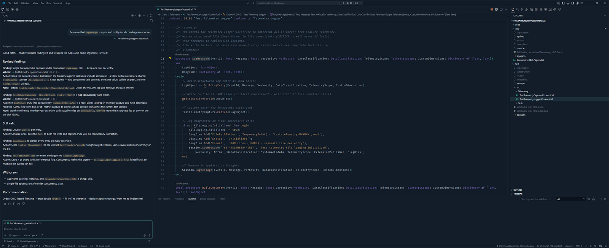
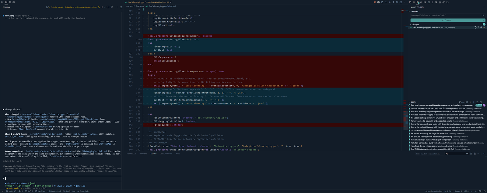

# Operator Dark

A calm, navy-charcoal editor theme designed for long coding sessions. Desaturated, contrast-first syntax with restrained teal and amber accents.

## Why this theme

Three rules drive every color choice.

- **Contrast before saturation.** Surfaces stay quiet — the syntax doesn't fight the layout for attention.
- **Restraint before novelty.** Two accents do the work — teal for UI state, amber for strings.
- **Colorblind-safe pairings.** No state in the theme — add vs delete, success vs error, modified vs untracked — relies on red vs green alone. Every meaningful pair is verified across deuteranopia, protanopia, and tritanopia.

## Install

1. Open VS Code → **Extensions** (`Ctrl+Shift+X`).
2. Search for `Operator Dark`.
3. Install, then `F1` → **Preferences: Color Theme** → **Operator Dark**.

## Highlights

- **One theme, no variants** — one well-tuned palette instead of three half-tuned ones.
- **Workbench + TextMate + semantic tokens** — full three-layer coverage, no scope-suffix surprises.
- **Theme-only diffs** — teal-green adds and warm coral deletes, no companion extension required.
- **AL / Business Central tuning** — sage-green fields, properties, enum members, and quoted identifiers (e.g. `::"All Customers"` highlights correctly).
- **Custom bracket pair colors** — teal → amber → purple → type-blue.
- **Italic comments only.**
- **Markdown preview styled to match** — body surfaces, headings, links, tables, blockquotes, and code-block chrome track the theme via VS Code CSS variables.

## Color palette

| Role | Hex |
|---|---|
| Editor background | `#121C28` |
| Sidebar / panels | `#131D29` |
| Activity bar | `#0F1822` |
| Title / status bar | `#111B26` |
| Default text | `#ECF2F8` |
| Variables / parameters | `#B5C2D0` |
| Keywords | `#9B7FD4` |
| Control flow | `#C9A6E8` |
| Functions / methods | `#E8B49B` |
| Types / classes | `#95BFE0` |
| Strings | `#DEB071` |
| Numbers / constants | `#F0D0A0` |
| AL fields | `#8CB87E` |
| Comments (italic) | `#74849A` |
| Teal accent | `#6CC9C7` |
| Error / deletion | `#E89A95` |

## Feedback

Issues, screenshots, and suggestions are welcome at [github.com/fbakkensen/OperatorDark/issues](https://github.com/fbakkensen/OperatorDark/issues).

## License

[MIT](LICENSE).
